# Cujae13-Proyecto

> [!NOTE]
> En la carpeta **/code** se encuentra el código del proyecto.
> En la carpeta **/build** se encuentran los archivos ejecutables.
> En la carpeta **/docs** se encuentra la documentación del proyecto.
> En la carpeta **/Roboto** se encuentra la fuente que se debe instalar pues es la
> usada en el proyecto.

Proyecto de ED en Java | Java Swing sobre un sistema para la administración de los
Juegos Deportivos "13 de Marzo".

## 💻 Características implementadas
- Sistema de guardado ficheros
- Sistema de guardado automático de datos cada 5 minutos
- Sistema de Reportes
- Implementación personalizada de un grafo ponderado por los vértices y por las aristas, 
implementando el algoritmo de Dijkstra
- Interfaz Intuitiva
- Animaciones
- Sistema de Mapas
- Sistema clasificatorio automatizado
- Sistema de asignación automática de eventos
- Dashboard_UI🎩 2.0

## 📸 Documentación general de la interfaz

### Autenticación
> 

### Admin
> 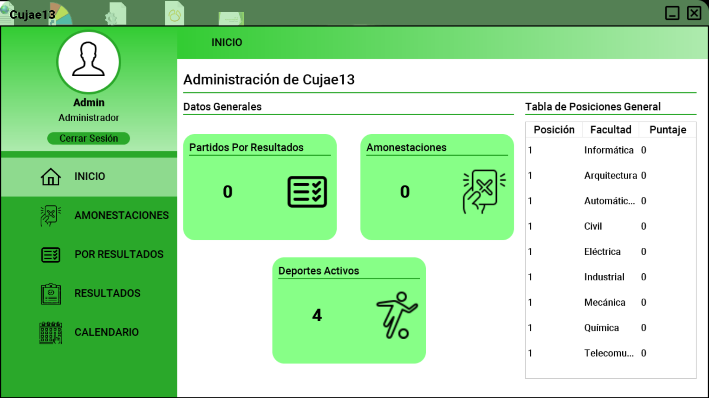

### Informática
> 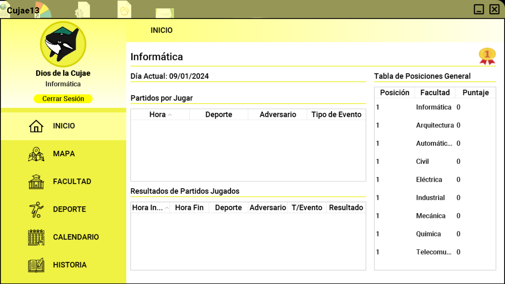

### Arquitectura
> 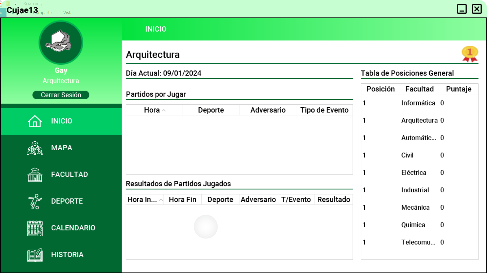

### Automática-Biomédica
> 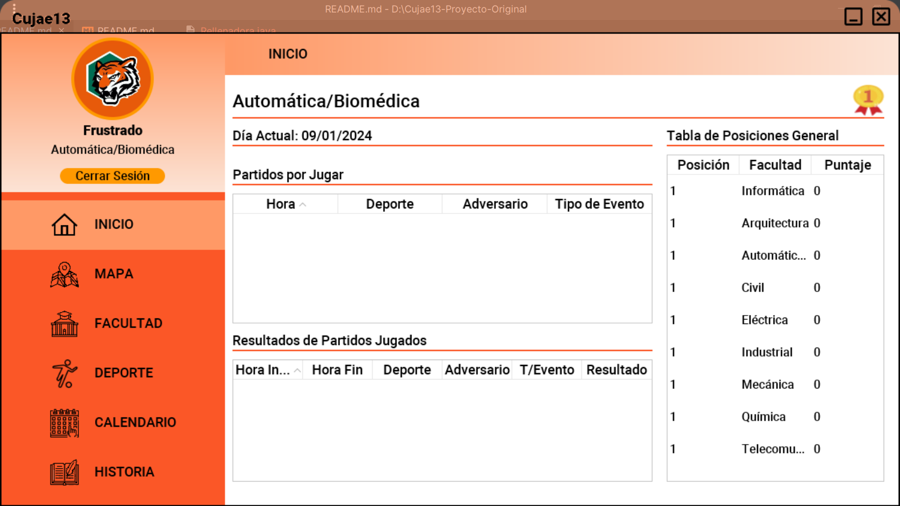

### Civil
> 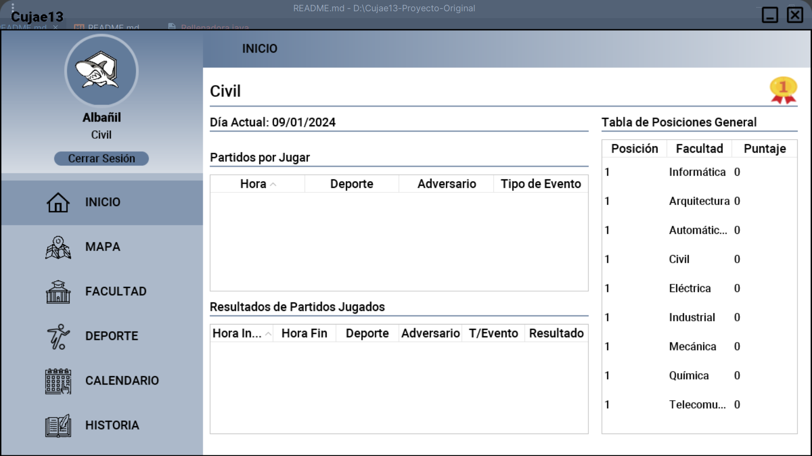

### Eléctrica
> 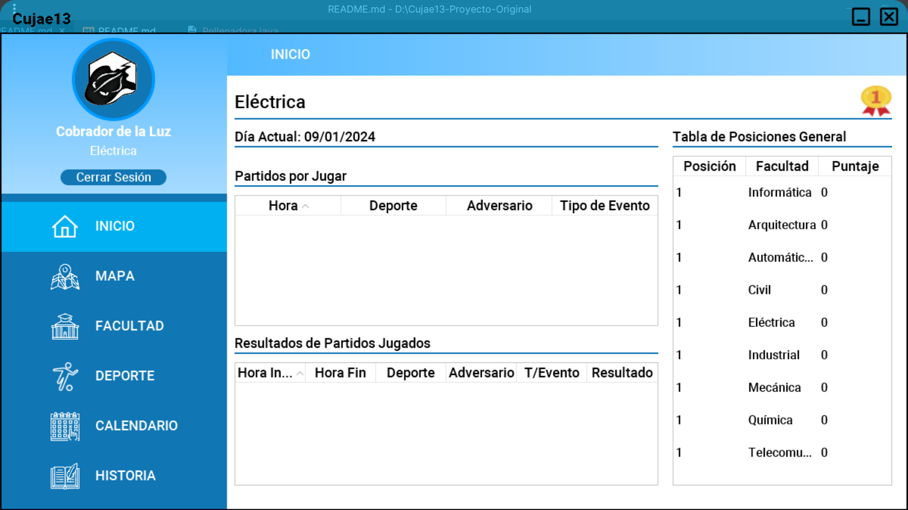

### Industrial
> 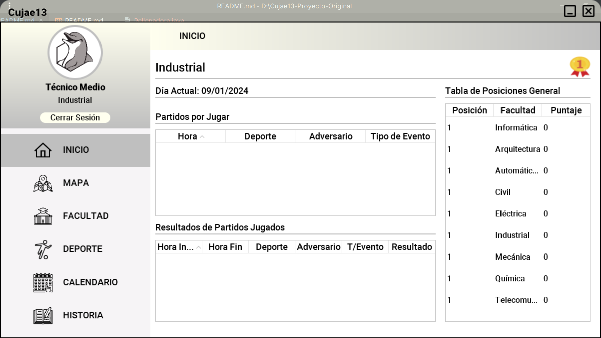

### Mecánica
> 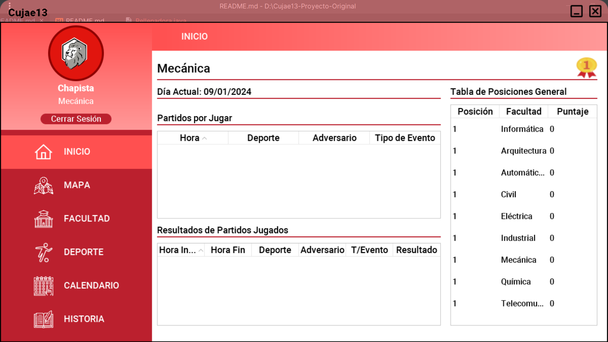

### Química
> 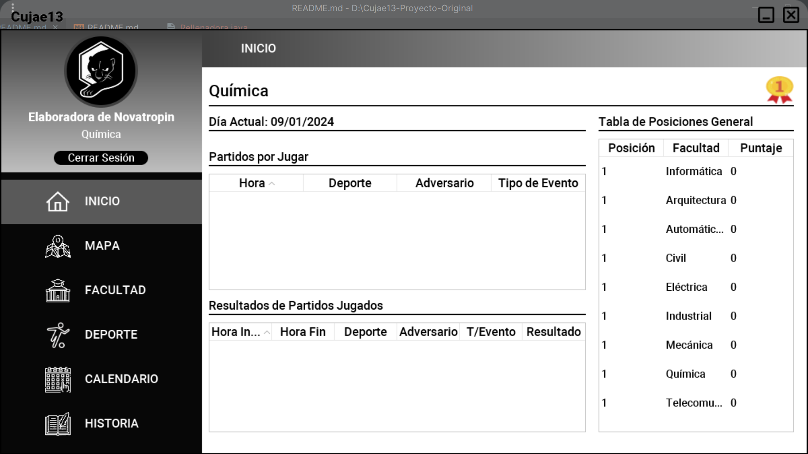

### Telecomunicaciones
> 

### Notificaciones Toast
> 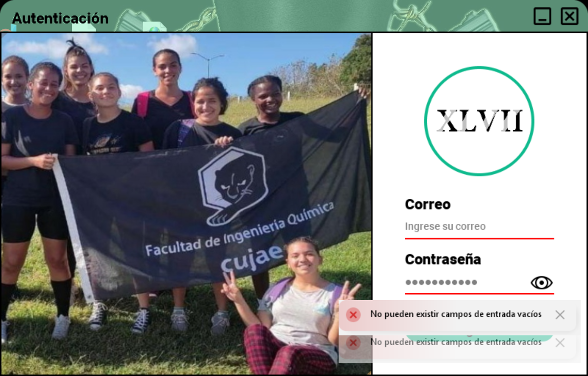

### Diálogos Personalizados
> 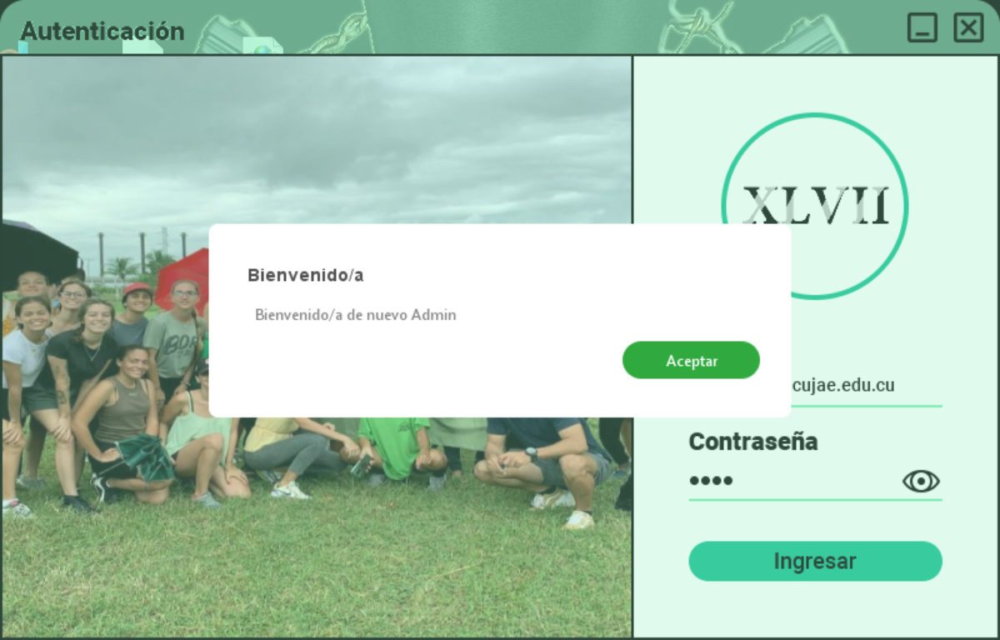

### Sistema Clasificatorio
> 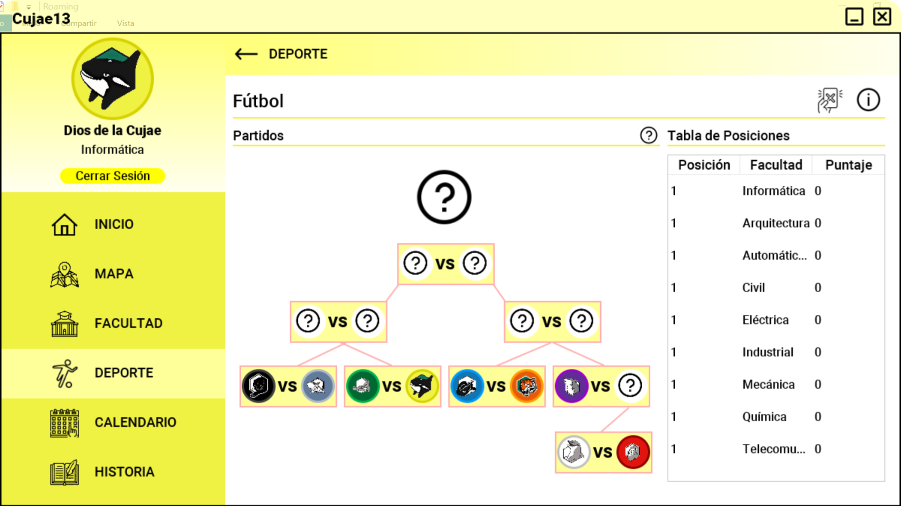

### Mapa Principal
> 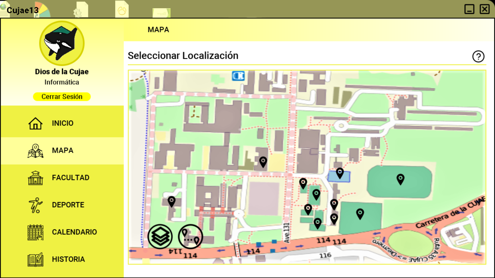

### Mapa Físico
> 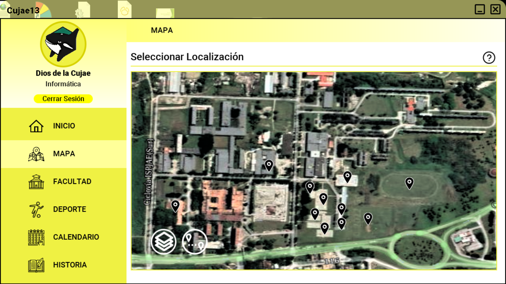

### Dijkstra
> 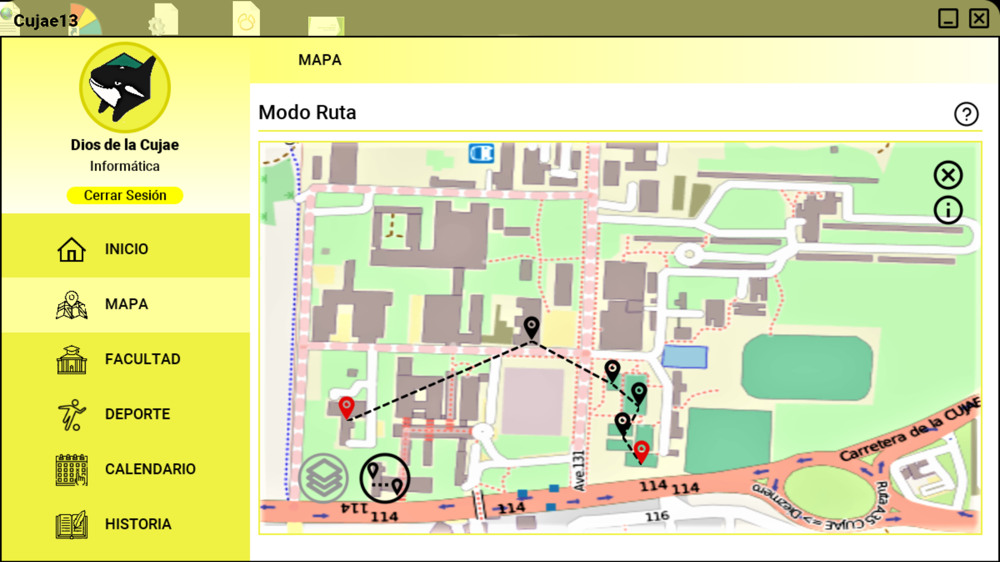

## 🤓 Usuarios de prueba

### Admin
`Correo:` admin@ceis.cujae.edu.cu

`Contraseña:` 1234

### Estudiante
#### Informática
`Correo:` info@ceis.cujae.edu.cu

`Contraseña:` 1234

#### Telecomunicaciones y Electrónica
`Correo:` tele@telecomunicaciones.cujae.edu.cu

`Contraseña:` 1234

#### Arquitectura
`Correo:` arqu@arquitectura.cujae.edu.cu

`Contraseña:` 1234

#### Automática-Biomédica
`Correo:` aubi@automatica.cujae.edu.cu

`Contraseña:` 1234

#### Civil
`Correo:` civi@civil.cujae.edu.cu

`Contraseña:` 1234

#### Eléctrica
`Correo:` elec@electrica.cujae.edu.cu

`Contraseña:` 1234

#### Industrial
`Correo:` indu@industrial.cujae.edu.cu

`Contraseña:` 1234

#### Mecánica
`Correo:` meca@mecanica.cujae.edu.cu

`Contraseña:` 1234

#### Química
`Correo:` quim@quimica.cujae.edu.cu

`Contraseña:` 1234

## 👾 Importación del proyecto
> [!IMPORTANT]
> Para importar correctamente el proyecto, debe tener como pre-requisito Java ~= 1.8

Los pasos son:
1. Clonar el repositorio o descargarlo.
2. Importar con Eclipse IDE o Intellij IDEA el proyecto en `/code/`

## 🚀 Descarga del ejecutable
Para descargar el ejecutable siga el [siguiente enlace](https://github.com/EduardoProfe666/Cujae13-Proyecto/releases/latest)

Para ejecutarlo una vez descargado:
- Ejecutar el `.exe` o el `.jar`. En cualquiera de los 2 casos debe tener pre-instalado 
Java ~= 1.8
- 
## 👥 Autores

**Curso 2023-2024** | **Grupo 21**

- Lilian Rosa Rojas Rodríguez 
- Katherine Ramírez Hidalgo
- Cristian Páez Olcha 
- Bryan García García 
- Eduardo Alejandro González Martell 

$${\color{green}Green}$$
